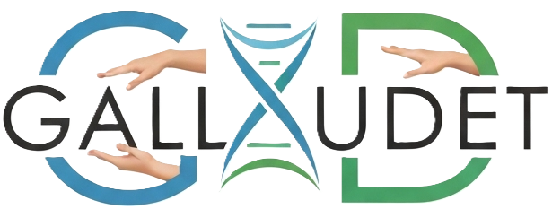

# Gallaudet - ASL Real-Time Translation Platform

<div align="center">



**A sophisticated web application for real-time American Sign Language (ASL) translation using advanced machine learning and computer vision.**

[](https://www.python.org/downloads/)
[](https://flask.palletsprojects.com/)
[](https://google.github.io/mediapipe/)
[](LICENSE)

</div>

---

## 📋 Table of Contents

- [Overview](#overview)
- [Features](#features)
- [Technology Stack](#technology-stack)
- [Architecture](#architecture)
- [Installation](#installation)
- [Configuration](#configuration)
- [Usage](#usage)
- [Project Structure](#project-structure)
- [API Documentation](#api-documentation)
- [Contributing](#contributing)
- [License](#license)
- [Acknowledgments](#acknowledgments)

---

## 🌟 Overview

**Gallaudet** is a cutting-edge web platform designed to bridge communication gaps by providing real-time ASL (American Sign Language) translation. Named after Thomas Hopkins Gallaudet, a pioneer in deaf education, this application leverages state-of-the-art machine learning models and computer vision technology to recognize and translate ASL gestures into text in real-time.

The platform combines Flask's robust backend capabilities with MediaPipe's advanced hand tracking and a custom-trained machine learning model to deliver accurate, low-latency ASL recognition.

---

## ✨ Features

### Core Functionality
- 🖐️ **Real-Time ASL Recognition** - Instant translation of ASL alphabet gestures using webcam input
- 🎯 **High Accuracy** - Custom-trained Random Forest model with optimized hand landmark detection
- ⚡ **Low Latency** - WebSocket-based communication for real-time video streaming and prediction
- 📊 **User Dashboard** - Track translation sessions, duration, and usage statistics

### User Management
- 🔐 **Secure Authentication** - Email/password registration with bcrypt encryption
- 🔑 **Google OAuth Integration** - One-click sign-in with Google accounts
- 👤 **User Profiles** - Personalized accounts with session history
- 📈 **Session Tracking** - Comprehensive logging of translation sessions and durations

### Administrative Features
- 🛠️ **Admin Panel** - Flask-Admin dashboard for user and system management
- 📊 **Analytics** - User activity tracking and engagement metrics
- 👥 **User Management** - CRUD operations for user accounts
- 🎛️ **System Controls** - Configuration and monitoring tools

### Additional Features
- 🎓 **Practice Mode** - Educational interface for learning ASL alphabet
- 📱 **Responsive Design** - Mobile-friendly interface with modern UI/UX
- 🌐 **Multi-Page Application** - About, FAQ, Contact, Careers, Privacy, and Terms pages
- 🔒 **Privacy Compliant** - GDPR-ready with comprehensive privacy policy

---

## 🛠️ Technology Stack

### Backend
- **Flask** - Core web framework
- **Flask-SQLAlchemy** - ORM for database operations
- **Flask-Login** - User session management
- **Flask-Bcrypt** - Password hashing and security
- **Flask-Dance** - OAuth integration (Google)
- **Flask-SocketIO** - WebSocket support for real-time communication
- **Flask-Admin** - Administrative dashboard
- **Flask-CORS** - Cross-origin resource sharing

### Machine Learning & Computer Vision
- **MediaPipe** - Hand landmark detection and tracking
- **scikit-learn** - Machine learning model (Random Forest Classifier)
- **OpenCV (cv2)** - Image processing and video manipulation
- **NumPy** - Numerical computations

### Frontend
- **HTML5/CSS3** - Modern, semantic markup
- **JavaScript (ES6+)** - Interactive client-side functionality
- **WebSocket** - Real-time bidirectional communication
- **Custom CSS** - Tailored styling and responsive design

### Database
- **SQLite** - Lightweight, file-based database for development
- **SQLAlchemy ORM** - Database abstraction layer

---

## 🏗️ Architecture

```
┌─────────────────────────────────────────────────────────────┐
│                        Client Browser                       │
│  ┌────────────┐  ┌────────────┐  ┌──────────────────────┐   │
│  │  Webcam    │  │   Flask    │  │   WebSocket Client   │   │
│  │  Capture   │→ │  Templates │← │   (SocketIO)         │   │
│  └────────────┘  └────────────┘  └──────────────────────┘   │
└──────────────────────────┬──────────────────────────────────┘
                           │ HTTP/WSS
                           ↓
┌─────────────────────────────────────────────────────────────┐
│                     Flask Application                       │
│  ┌────────────────────────────────────────────────────────┐ │
│  │              app.py (Main Application)                 │ │
│  │  • Authentication Routes                               │ │
│  │  • User Dashboard                                      │ │
│  │  • Session Management                                  │ │
│  │  • Admin Panel                                         │ │
│  └────────────────────────────────────────────────────────┘ │
│                           │                                 │
│  ┌────────────────────────────────────────────────────────┐ │
│  │         application.py (ML Service - Port 5001)        │ │
│  │  • WebSocket Handler                                   │ │
│  │  • Frame Processing                                    │ │
│  │  • MediaPipe Integration                               │ │
│  │  • Model Prediction                                    │ │
│  └────────────────────────────────────────────────────────┘ │
└──────────────────┬────────────────┬─────────────────────────┘
                   │                │
                   ↓                ↓
        ┌──────────────────┐  ┌──────────────────┐
        │   SQLite DB      │  │  ML Model Files  │
        │   (database.db)  │  │  • ASL_model.p   │
        │                  │  │  • ASL.pickle    │
        └──────────────────┘  └──────────────────┘
```

### Dual Server Architecture

The application runs on two separate Flask servers:

1. **Main Application Server** (`app.py` - Port 5000)
   - Handles user authentication, routing, and dashboard
   - Manages database operations and session tracking
   - Serves static HTML templates

2. **ML Service Server** (`application.py` - Port 5001)
   - Dedicated to real-time video processing
   - Handles WebSocket connections for frame streaming
   - Performs hand detection and ASL prediction
   - Isolated for optimal ML performance

---

## 📦 Installation

### Prerequisites

- Python 3.8 or higher
- pip (Python package manager)
- Webcam (for ASL recognition features)

### Step 1: Clone the Repository

```bash
git clone https://github.com/A-P-Shukla/gallaudet.git
cd gallaudet
```

### Step 2: Create Virtual Environment

```bash
# Windows
python -m venv venv
venv\Scripts\activate

# macOS/Linux
python3 -m venv venv
source venv/bin/activate
```

### Step 3: Install Dependencies

```bash
pip install flask flask-sqlalchemy flask-login flask-bcrypt flask-admin
pip install flask-wtf wtforms email-validator
pip install flask-dance flask-cors flask-socketio
pip install opencv-python mediapipe scikit-learn numpy
```

Or create a `requirements.txt` file:

```txt
Flask==2.3.0
Flask-SQLAlchemy==3.0.5
Flask-Login==0.6.2
Flask-Bcrypt==1.0.1
Flask-Admin==1.6.1
Flask-WTF==1.1.1
WTForms==3.0.1
email-validator==2.0.0
Flask-Dance==7.0.0
Flask-CORS==4.0.0
Flask-SocketIO==5.3.4
opencv-python==4.8.0
mediapipe==0.10.3
scikit-learn==1.3.0
numpy==1.24.3
python-engineio==4.7.1
python-socketio==5.9.0
```

Then install:

```bash
pip install -r requirements.txt
```

### Step 4: Initialize Database

```bash
python
>>> from app import app, db
>>> with app.app_context():
...     db.create_all()
>>> exit()
```

Or simply run the main application once (it will auto-create the database):

```bash
python app.py
```

---

## 🔧 Git & Version Control

### Setup Git Repository

```bash
git init
git add .
git commit -m "Initial commit"
```

### .gitignore

The project includes a comprehensive `.gitignore` file that excludes:

- **Python artifacts** - `__pycache__/`, `*.pyc`, `*.pyo`
- **Virtual environments** - `venv/`, `env/`, `.venv/`
- **Database files** - `*.db`, `*.sqlite`, `database.db`
- **Environment variables** - `.env`, `.env.local`
- **IDE settings** - `.vscode/`, `.idea/`, `*.swp`
- **Logs and temporary files** - `*.log`, `*.tmp`
- **OAuth credentials** - `client_secret*.json`

---

## ⚙️ Configuration

### Environment Variables

For Google OAuth integration, set the following environment variables:

**Windows (PowerShell):**
```powershell
$env:GOOGLE_OAUTH_CLIENT_ID="your_google_client_id"
$env:GOOGLE_OAUTH_CLIENT_SECRET="your_google_client_secret"
```

**macOS/Linux:**
```bash
export GOOGLE_OAUTH_CLIENT_ID="your_google_client_id"
export GOOGLE_OAUTH_CLIENT_SECRET="your_google_client_secret"
```

### Obtaining Google OAuth Credentials

1. Visit [Google Cloud Console](https://console.cloud.google.com/)
2. Create a new project or select an existing one
3. Enable the Google+ API
4. Go to "Credentials" → "Create Credentials" → "OAuth client ID"
5. Set application type to "Web application"
6. Add authorized redirect URI: `http://localhost:5000/google_login/google/authorized`
7. Copy the Client ID and Client Secret

### Secret Key Configuration

**⚠️ Important for Production:**

Change the secret keys in both `app.py` and `application.py`:

```python
# app.py
app.config['SECRET_KEY'] = 'your-secure-random-secret-key-here'

# application.py
app.config['SECRET_KEY'] = 'your-secure-ml-service-key-here'
```

Generate secure random keys using:
```python
import secrets
print(secrets.token_hex(32))
```

---

## 🚀 Usage

### Starting the Application

You need to run **both** servers for full functionality:

**Terminal 1 - Main Application:**
```bash
python app.py
```
Access at: `http://localhost:5000`

**Terminal 2 - ML Service:**
```bash
python application.py
```
Running at: `http://localhost:5001`

### User Workflow

1. **Registration/Login**
   - Visit `http://localhost:5000`
   - Click "Sign Up" to create an account or "Sign In" with existing credentials
   - Alternatively, use "Continue with Google" for OAuth login

2. **Dashboard**
   - After login, view your translation session statistics
   - Access recent session history
   - Track total usage time

3. **Live Translation**
   - Navigate to "Live Translation" from the dashboard
   - Allow webcam access when prompted
   - Perform ASL alphabet gestures in front of the camera
   - See real-time predictions displayed on screen

4. **Practice Mode**
   - Access the practice interface to learn ASL alphabet
   - Interactive guide for each letter

### Admin Access

To create an admin user:

```python
python
>>> from app import app, db, User
>>> with app.app_context():
...     admin = User.query.filter_by(email='admin@example.com').first()
...     admin.is_admin = True
...     db.session.commit()
>>> exit()
```

Access admin panel at: `http://localhost:5000/admin`

---

## 📂 Project Structure

```
gallaudet/
│
├── app.py                      # Main Flask application
├── application.py              # ML service (WebSocket server)
├── models.py                   # Database models (legacy/unused)
├── verify_migration.py         # Database verification utility
├── database.db                 # SQLite database file
├── .gitignore                  # Git ignore patterns
├── README.md                   # Project documentation (this file)
│
├── asl_prediction/             # Machine Learning assets
│   ├── ASL_model.p            # Trained Random Forest model (16.3 MB)
│   └── ASL.pickle             # Training data/artifacts (3.6 MB)
│
├── templates/                  # HTML templates
│   ├── _header.html           # Navigation header component
│   ├── _footer.html           # Footer component
│   ├── index.html             # Landing page
│   ├── about.html             # About page
│   ├── register.html          # User registration
│   ├── signin.html            # User login
│   ├── dashboard.html         # User dashboard
│   ├── live_translation.html  # Real-time ASL translation
│   ├── practice.html          # ASL practice mode
│   ├── account.html           # User account settings
│   ├── faq.html               # Frequently asked questions
│   ├── contact.html           # Contact page
│   ├── careers.html           # Careers page
│   ├── privacy.html           # Privacy policy
│   ├── terms.html             # Terms of service
│   └── admin/                 # Admin panel templates
│       └── index.html         # Admin dashboard
│
├── static/                     # Static assets
│   ├── logo.png               # Gallaudet logo
│   ├── style.css              # Custom CSS styles
│   ├── main.js                # Client-side JavaScript
│   ├── akhand.jpg             # Team member photo
│   ├── akarsh.jpg             # Team member photo
│   ├── agrim.jpg              # Team member photo
│   └── anshuman.jpg           # Team member photo
│
└── __pycache__/                # Python cache files
```

---

## 📡 API Documentation

### WebSocket Events

#### Client → Server

**Event:** `process_frame`

**Payload:**
```json
{
  "image_data": "data:image/jpeg;base64,/9j/4AAQSkZJRg..."
}
```

**Description:** Sends a base64-encoded video frame for ASL prediction.

#### Server → Client

**Event:** `prediction_result`

**Payload:**
```json
{
  "prediction": "A",
  "landmarks": [
    {"x": 0.523, "y": 0.412, "z": -0.023},
    ...
  ]
}
```

**Description:** Returns predicted ASL letter and hand landmark coordinates.

### HTTP Endpoints

#### Authentication Routes

| Method | Endpoint | Description | Auth Required |
|--------|----------|-------------|---------------|
| GET/POST | `/register` | User registration | No |
| GET/POST | `/signin` | User login | No |
| GET | `/logout` | User logout | Yes |
| GET | `/google_login/google` | Initiate Google OAuth | No |

#### Application Routes

| Method | Endpoint | Description | Auth Required |
|--------|----------|-------------|---------------|
| GET | `/` | Landing page | No |
| GET | `/dashboard` | User dashboard | Yes |
| GET | `/live-translation` | Start live ASL translation | Yes |
| GET | `/practice` | Practice mode | Yes |
| GET/POST | `/account` | User account settings | Yes |

#### Session Management

| Method | Endpoint | Description | Auth Required |
|--------|----------|-------------|---------------|
| POST | `/session/end` | End translation session | Yes |

**Request Body:**
```json
{
  "session_id": 123
}
```

**Response:**
```json
{
  "status": "success"
}
```

#### Public Pages

| Method | Endpoint | Description |
|--------|----------|-------------|
| GET | `/about` | About page |
| GET | `/faq` | FAQ page |
| GET | `/contact` | Contact page |
| GET | `/careers` | Careers page |
| GET | `/privacy` | Privacy policy |
| GET | `/terms` | Terms of service |

---

## 🤝 Contributing

We welcome contributions from the community! Follow these steps to contribute:

### 1. Fork the Repository

Click the "Fork" button at the top right of this repository.

### 2. Clone Your Fork

```bash
git clone https://github.com/A-P-Shukla/gallaudet.git
cd gallaudet
```

### 3. Create a Feature Branch

```bash
git checkout -b feature/your-feature-name
```

### 4. Make Your Changes

- Follow PEP 8 style guidelines for Python code
- Add comments for complex logic
- Update documentation as needed

### 5. Test Your Changes

Ensure the application runs without errors:
```bash
python app.py
python application.py
```

### 6. Commit and Push

```bash
git add .
git commit -m "Add: description of your changes"
git push origin feature/your-feature-name
```

### 7. Create a Pull Request

Open a pull request from your fork to the main repository.

---

## 📄 License

This project is licensed under the MIT License - see the [LICENSE](LICENSE) file for details.

---

## 🙏 Acknowledgments

### Team

- **Akhand** - Project Lead
- **Akarsh** 
- **Agrim** 
- **Anshuman** 

### Technologies

- **MediaPipe** by Google - For state-of-the-art hand tracking
- **Flask** - For the robust web framework
- **scikit-learn** - For machine learning capabilities

### Inspiration

Named after **Thomas Hopkins Gallaudet** (1787-1851), a pioneering American educator who founded the first permanent school for the deaf in the United States. This project honors his legacy by using technology to break down communication barriers.

---

## 📞 Contact

For questions, suggestions, or support:

- **Email:** akhandshukla36@gmail.com
- **Issues:** [GitHub Issues](https://github.com/A-P-Shukla/gallaudet/issues)
- **Website:** Visit the `/contact` page

---

## 🔮 Future Roadmap

- [ ] Support for full ASL words and phrases (beyond alphabet)
- [ ] Multi-language translation support
- [ ] Mobile application (iOS/Android)
- [ ] Improved model accuracy with deep learning (CNN/LSTM)
- [ ] Real-time conversation mode with multiple users
- [ ] Integration with video conferencing platforms
- [ ] Accessibility features for screen readers
- [ ] API for third-party integrations

---

<div align="center">

**Built with ❤️ for the deaf and hard-of-hearing community**

[⬆ Back to Top](#gallaudet---asl-real-time-translation-platform)

</div>
